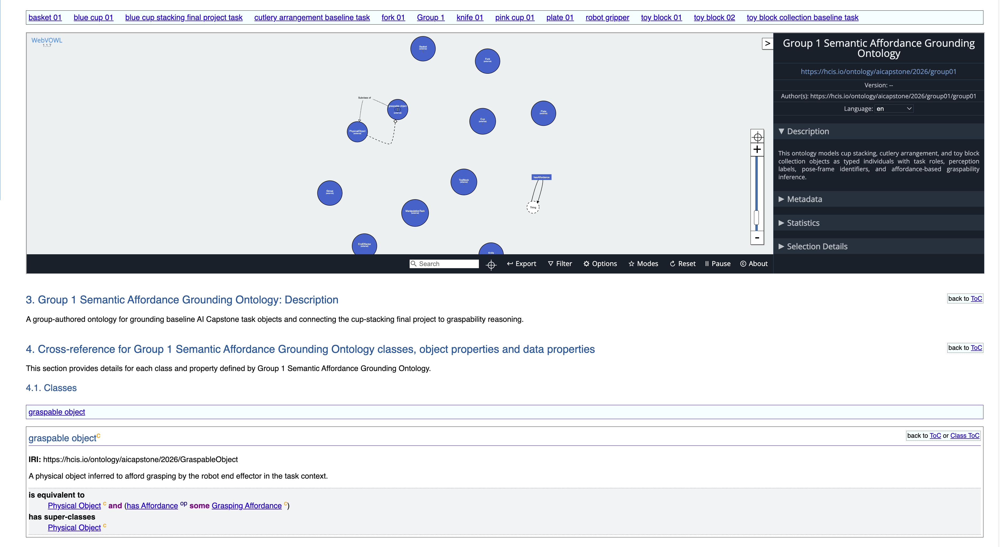
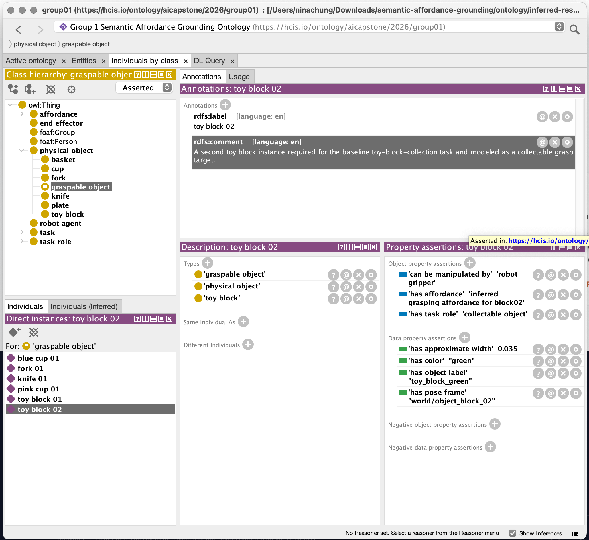

# Report: Ontology-based Semantic Grounding

## Overview

This repository implements a compact ontology-based semantic grounding layer for Homework 5. The final-project task is cup stacking, where a learned robot policy moves a blue cup onto a pink cup. The ontology connects that task to explicit object types, task roles, perception labels, pose-frame identifiers, and affordance-based graspability reasoning.

Although the final project focuses on cup stacking, the homework requires baseline coverage for all three predefined task settings. Therefore, the ontology also includes individuals for knife, fork, plate, toy blocks, and basket.

## Ontology Design

The group-authored ontology is `ontology/group-ontology.ttl`. It imports the shared course vocabulary from `ontology/imports/course-affordance.ttl` and uses course terms under the `cap:` namespace for common classes and properties. Group-specific tasks and individuals are declared under the Group 1 `g01:` namespace:

```ttl
@prefix cap: <https://hcis.io/ontology/aicapstone/2026/> .
@prefix g01: <https://hcis.io/ontology/aicapstone/2026/group01/> .
```

This separates shared course vocabulary from Group 1 authored objects, tasks, and workflow-specific individuals.

The ontology distinguishes four modeling layers:

| Layer | Example |
| --- | --- |
| Object type | `cap:Cup`, `cap:Knife`, `cap:ToyBlock`, `cap:Basket` |
| Task role | `cap:TargetObject`, `cap:ReferenceObject`, `cap:CollectableObject`, `cap:ContainerTarget` |
| Affordance | `cap:GraspingAffordance`, `cap:StackabilityAffordance`, `cap:SupportAffordance`, `cap:ContainmentAffordance` |
| Instance | `g01:blueCup01`, `g01:pinkCup01`, `g01:knife01`, `g01:block01` |

This avoids the common modeling error of treating every task-related object as automatically graspable.

## Modeled Objects

The main cup-stacking objects are:

- `g01:blueCup01`: a `cap:Cup`, modeled as the direct target object for the final project policy.
- `g01:pinkCup01`: a `cap:Cup`, modeled as the stacking reference object for the final project policy.

The required baseline objects are:

- `g01:knife01`: a `cap:Knife` target object.
- `g01:fork01`: a `cap:Fork` target object.
- `g01:plate01`: a `cap:Plate` reference/support object.
- `g01:block01` and `g01:block02`: `cap:ToyBlock` collectable objects.
- `g01:basket01`: a `cap:Basket` container target.

Each task-relevant individual has an `rdfs:label`, an `rdfs:comment`, a perception label through `cap:hasObjectLabel`, a task role through `cap:hasTaskRole`, and a pose-frame identifier through `cap:hasPoseFrame`.

## Key Axiom and Reasoning Pattern

The target inferred class is `cap:GraspableObject`. It is defined as a physical object with at least one grasping affordance:

```ttl
cap:GraspableObject
    a owl:Class ;
    rdfs:subClassOf cap:PhysicalObject ;
    owl:equivalentClass [
        a owl:Class ;
        owl:intersectionOf (
            cap:PhysicalObject
            [
                a owl:Restriction ;
                owl:onProperty cap:hasAffordance ;
                owl:someValuesFrom cap:GraspingAffordance
            ]
        )
    ] .
```

The course ontology already states, for example, that `cap:Cup`, `cap:Knife`, `cap:Fork`, and `cap:ToyBlock` have an existential restriction to `cap:GraspingAffordance`. The reasoning workflow uses those class restrictions to infer which individuals are graspable.

## Inference Implementation

The workflow is implemented in `src/reason_and_query.py` using RDFLib. RDFLib is used for RDF/Turtle parsing, graph manipulation, and SPARQL execution. The additional reasoning step is a small rule layer:

1. Load the course ontology, alignment ontology, and group ontology.
2. Find subclasses of `cap:PhysicalObject`.
3. Find classes that have an `owl:someValuesFrom cap:GraspingAffordance` restriction on `cap:hasAffordance`.
4. For each individual typed as one of those classes, materialize:
   - `rdf:type cap:PhysicalObject`
   - `rdf:type cap:GraspableObject`
   - an inferred named grasping affordance individual connected by `cap:hasAffordance`
5. Export the resulting graph to `ontology/inferred-results.ttl`.

This is documented as rule-based inference rather than full OWL 2 DL reasoning. It is sufficient for the homework target because it directly implements the specified graspability pattern.

## Query Results

The required query is `queries/graspable_objects.rq`. It selects individuals typed as `cap:GraspableObject` from the inferred graph:

```sparql
SELECT DISTINCT ?obj ?name ?label ?role
WHERE {
  ?obj rdf:type cap:GraspableObject .
  OPTIONAL { ?obj rdfs:label ?name . }
  OPTIONAL { ?obj cap:hasObjectLabel ?label . }
  OPTIONAL { ?obj cap:hasTaskRole ?role . }
}
ORDER BY ?obj
```

The expected inferred graspable objects are:

- `g01:blueCup01`
- `g01:pinkCup01`
- `g01:knife01`
- `g01:fork01`
- `g01:block01`
- `g01:block02`

The plate and basket are not inferred as graspable in this model. The plate is modeled as a support/reference object, and the basket is modeled as a container target. They are task-relevant but not direct grasp targets for this semantic design.

## Reproducibility

Install dependencies:

```bash
python3 -m pip install -r requirements.txt
```

Regenerate the inferred graph and saved query output:

```bash
python3 src/reason_and_query.py
```

The generated files are:

- `ontology/inferred-results.ttl`
- `results/graspable_objects_output.txt`

The repository also includes `results/screenshots/query_output_terminal.png` as a visual record of the command-line workflow. Since this submission uses RDFLib as the main reasoning and query workflow, the saved text output and regenerated inferred graph remain the primary reproducibility artifacts.

## Widoco and Protege Validation

Widoco was used to generate ontology documentation from `ontology/group-ontology.ttl`. The generated documentation provides evidence that the ontology metadata, WebVOWL visualization, named individuals, and cross-reference entries can be read by an ontology documentation tool. In particular, the Widoco page shows the `graspable object` cross-reference and its key equivalence axiom: `Physical Object and (has Affordance some Grasping Affordance)`.



Protege was also used as a visual validation tool by opening `ontology/inferred-results.ttl` and inspecting the `Individuals by class` view. Under `physical object > graspable object`, Protege displayed the six expected materialized instances: blue cup 01, pink cup 01, knife 01, fork 01, toy block 01, and toy block 02. Plate 01 and basket 01 were not listed under `graspable object`, matching the ontology design.



## Imported Resource Note

The submitted copy of `ontology/imports/course-affordance.ttl` uses the updated course ontology from the course GitHub repository. It is treated as an imported shared vocabulary rather than a Group 1 authored ontology file.

## Limitations

This ontology is intentionally compact. It does not model physical dynamics, grasp pose generation, trajectory planning, or learned policy behavior. Those remain part of the final project pipeline. The semantic layer complements the model by making object identity, task role, and graspability assumptions explicit and queryable.

The reasoning workflow is also not a complete OWL reasoner. It materializes the specific existential-restriction pattern required by Homework 5. A future extension could run a full OWL reasoner such as HermiT/Pellet or use a Jena inference model for broader OWL reasoning support.
